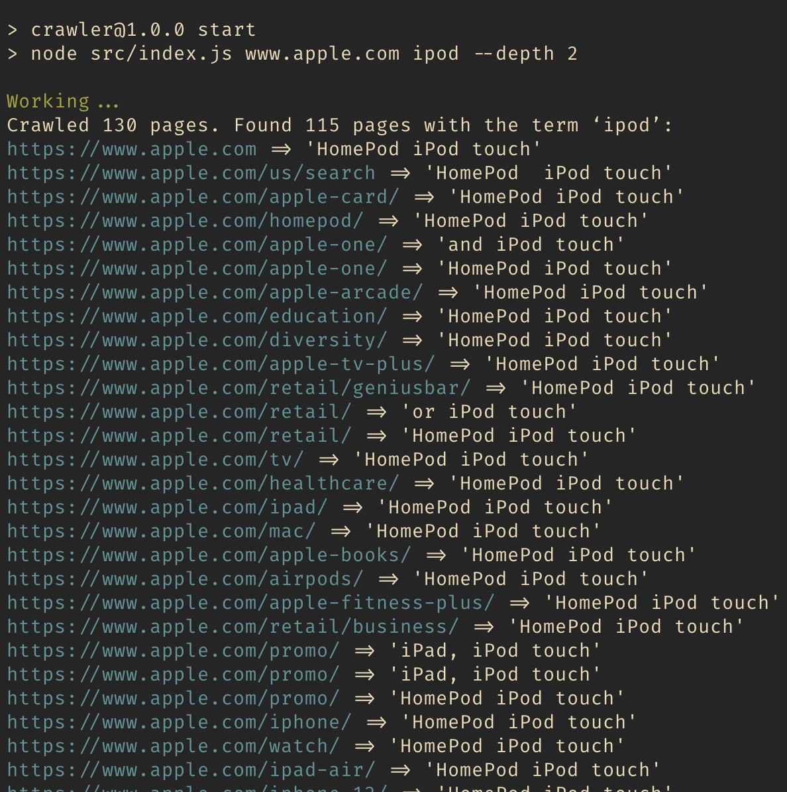

## Available Scripts

In the project directory, you can run:

### `npm start`

Runs the app with default arguments (www.apple.com, `ipod`, `2` link depth)

### `npm run dev`

Launches the development server in the watch mode (also with default arguments).

### `node src <url> <phrase> [--depth <number>]`
Use this command to run with own arguments